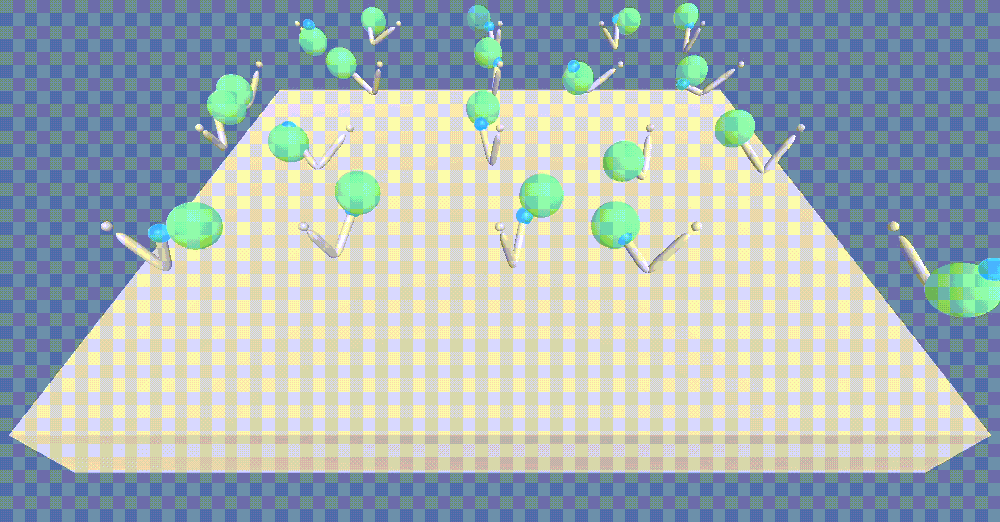

# Project 2: Continuous Control - Deep Reinforcement Learning

## Project Details

---

- A number of 20 robotic arms being trained to follow a specific trace shown by the ball rotating around the arm.
- **states**: The state space is comprised of 33 dimensions.
- **action_space**: Four action spaces which the agent might decide.
- **goal**: The environment is considered solved if agent gets an average score of +30 over 100 consecutive episodes

### Reinforcement Learning Algorithm

- The Algorithm is Deep Deterministic Policy Gradient  (DDPG)

- It relies on two deep learning networks (actor network and critic network)

- The critic network in this algorithm is like the dqn network but can handle continuous action values as it receives the output of the actor network which represents the chosen action.

- Whereas the actor network is trained to output the best action `μ(s; θ)` for a given state. Unlike typical actor-critic algorithm in which the actor outputs the policy `π(a | s; θ)`, where
  - `s`: state
  - `θ`: model parameters
  - `a`: action

- The Neural Network model is softly updated to a target model in order to keep the learning stable

## Getting Started

---

- Clone this repo

```bash
git clone https://github.com/beber89/deepRL-udaproj2-continuous-control
```

- Install python dependencies pytorch, matplotlib & unityagents

```bash
pip install torch matplotlib unityagents
```

- Download the unity environment
  - Linux: [click here](https://s3-us-west-1.amazonaws.com/udacity-drlnd/P2/Reacher/Reacher_Linux.zip)
  - Mac OSX: [click here](https://s3-us-west-1.amazonaws.com/udacity-drlnd/P2/Reacher/Reacher.app.zip)
  - Windows (32-bit): [click here](https://s3-us-west-1.amazonaws.com/udacity-drlnd/P2/Reacher/Reacher_Windows_x86.zip)
  - Windows (64-bit): [click here](https://s3-us-west-1.amazonaws.com/udacity-drlnd/P2/Reacher/Reacher_Windows_x86_64.zip)

## Instructions

---

### Training

- Open `Continuous_Control.ipynb`

- Navigate the notebook until you reach the `3. Watch the agent play` section and click on that cell

- Click `Cell` in the menu bar then click `Run All Above`

- Wait until the agent finishes training

### Run Trained Agent

- Open `Continuous_Control.ipynb`

- Navigate the notebook until you reach the `1. Training` section and click on that cell

- Click `Cell` in the menu bar then click `Run All Above`

- Navigate the notebook until you reach the `3. Watch the agent play` section and click on that cell

- Click `Cell` in the menu bar then click `Run All Below`

- This loads the weights into the model from file `checkpoint.pth`

- A unity window pops up showing the agent playing the game


